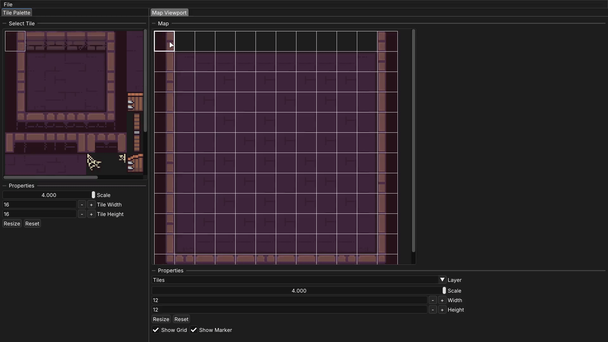

## SBMap
SBMap is a simple 2D tilemap editor, originally created as an internal tool for the Squareball project.
The current implementation is tailored to Squareball's needs, with some systems being intentionally specialized rather than generic.

---


## Project Scope
SBMap focuses on simplicity and easy integration with Squareball over flexibility.

As a result:
- The editor does not support project files or arbitrary configurations
- The tilemap import/export format is proprietary and optimized for Squareball's tilemap structure
- The available map layers and their behaviors are intentionally hardcoded for simplicity
- The data constraints match those used in Squareball

## Key Features
- Consistent style across multiple platforms
- Simple and easy-to-use UI
- User-friendly error messages
- Native file dialogs
- Support for display scaling and high-DPI screens
- Fully resizable viewports
- Dockable widgets
- Keyboard shortcuts for menu options

## Supported Platforms
SBMap is primarily developed for Linux and Windows using GCC and Clang compilers.
Although other platforms and compilers have not been officially tested, the project is designed with portability in mind.

## Dependencies
SBMap depends on the following libraries:
- External
	- **SDL3** >= 3.2 - Windowing, input and rendering
- Vendored
	- **Dear ImGui** - GUI library
	- **stb_image** - Image loading

External dependencies are expected to be available during configuration. If they are not found, CMake will automatically fetch and build them as part of the project.
Vendored dependencies are included in the `vendor` directory and are compiled together with the project. No prior installation is required.

## Build Instructions
**Requirements**:
- CMake 3.15 or newer
- A CMake-supported build system (Make, Ninja, MSBuild, etc.)
- A C++20-compatible compiler
- Git

Clone the repository:
```sh
git clone https://github.com/mZake/SBMap.git
cd SBMap
```

Build using CMake:
```sh
cmake -S . -B build
cmake --build build
```

After the build finishes, the SBMap executable and its runtime dependencies can be found in the `build` directory.

## Third-party Licenses
### Inter Font
This software embeds the **Inter** font.

Copyright 2020 The Inter Project Authors (https://github.com/rsms/inter)

This Font Software is licensed under the SIL Open Font License, Version 1.1.
This license is available with a FAQ at: https://openfontlicense.org

A copy of the OFL license is included in this repository. See OFL.txt
